# CGRA 2020/2021

## Group T05G05

## Group Members
| Name                | Number    |
| ------------------- | --------- |
| Ângela Coelho       | 201907549 |
| Nuno Castro         | 202003324 |

## Project Notes

- We chose to implement 7.1, 7.5 and 7.6 funcionalities from the optional ones.

## Screenshots

### 1 - MyFish

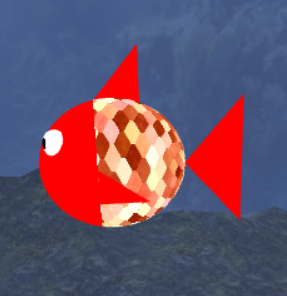
- Lateral view

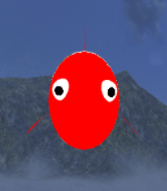
- Frontal view

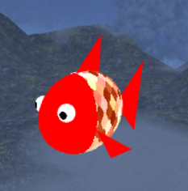
- Panoramic view

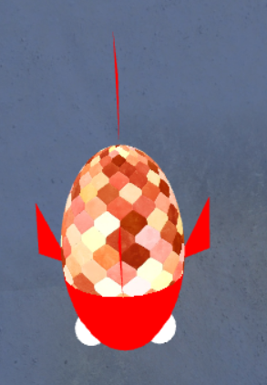
- Top view

### 2 - Sea Floor
 
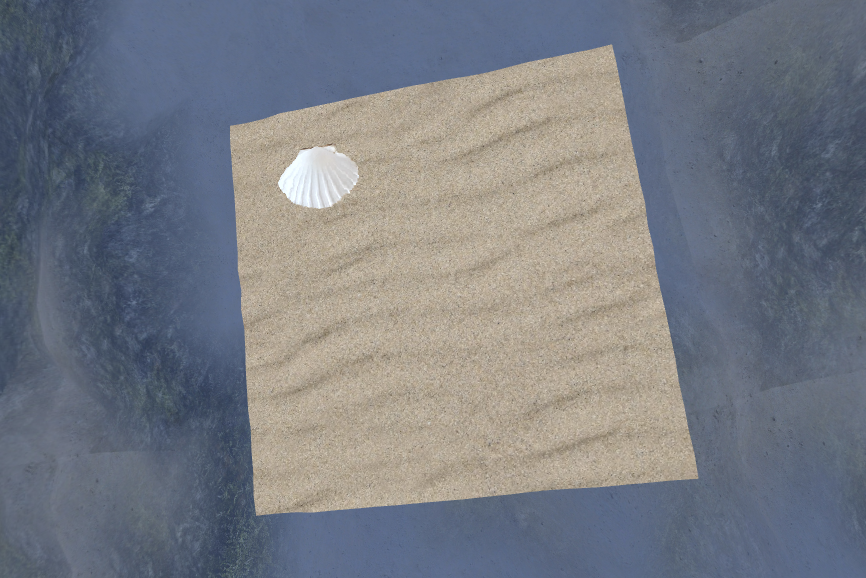
- Top view

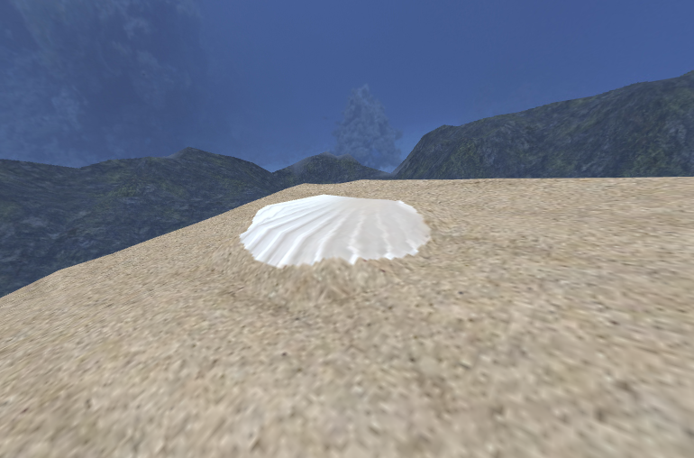
- Shell height detail
### 3 - Water

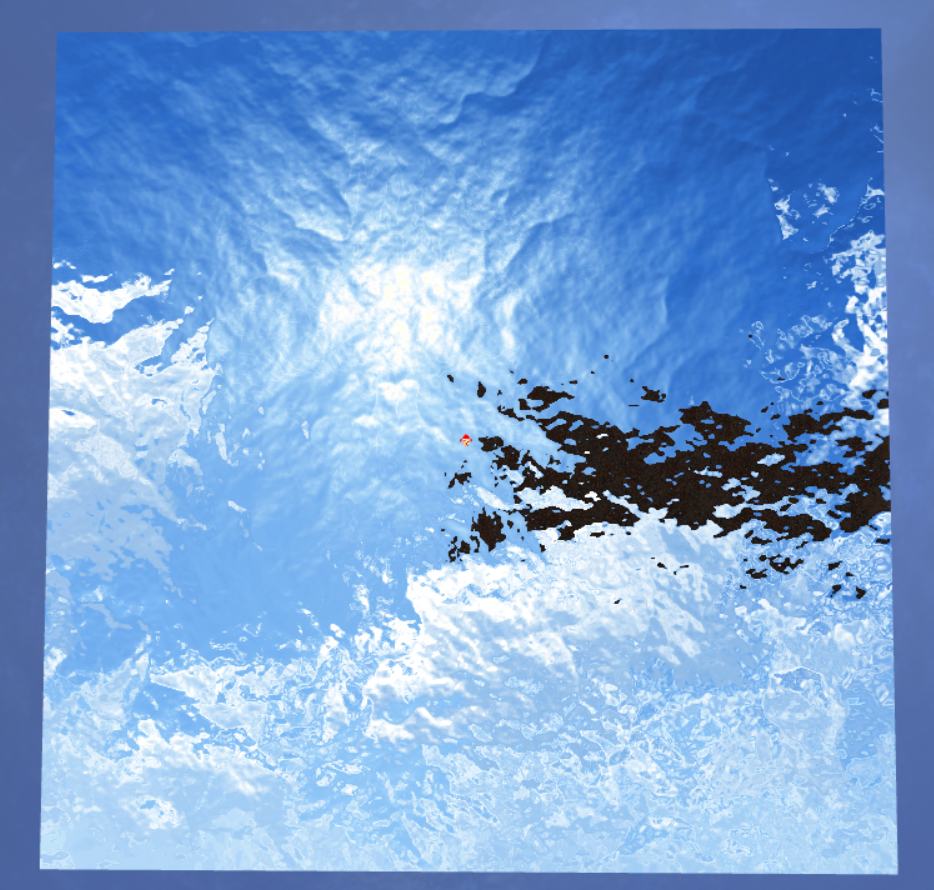
- Bottom view

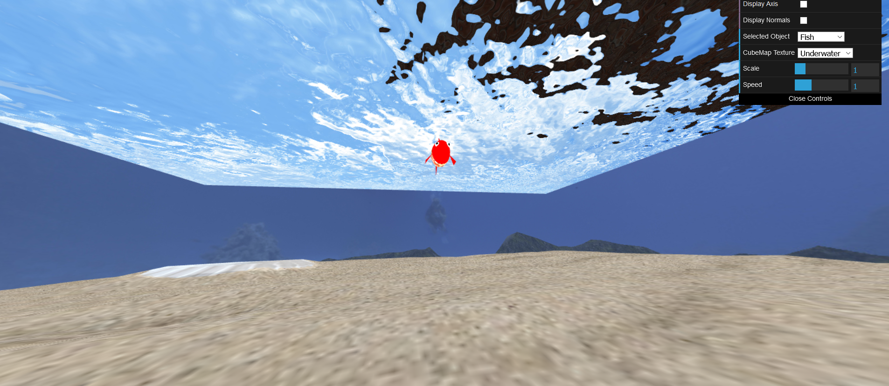
- Panoramic view
### 4 - Rocks

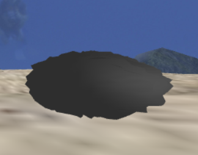
- Rock example

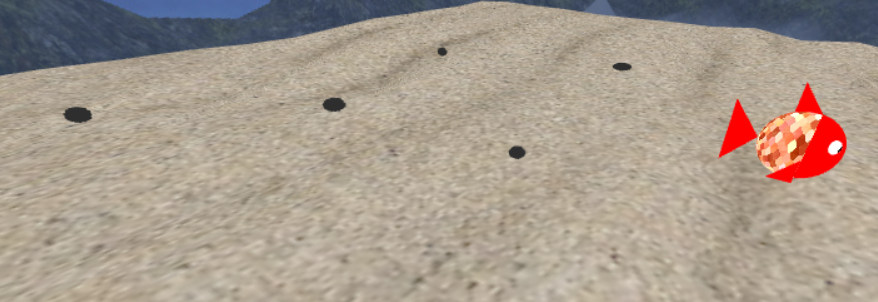
- Random rock placement
### 5 - Poles

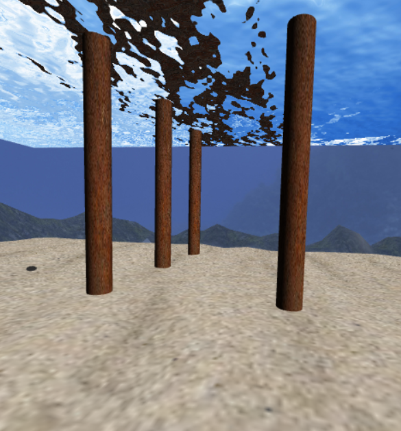
- Frontal view

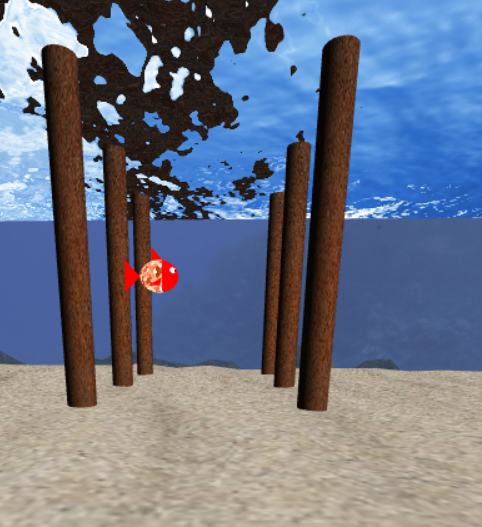
- Another perspective

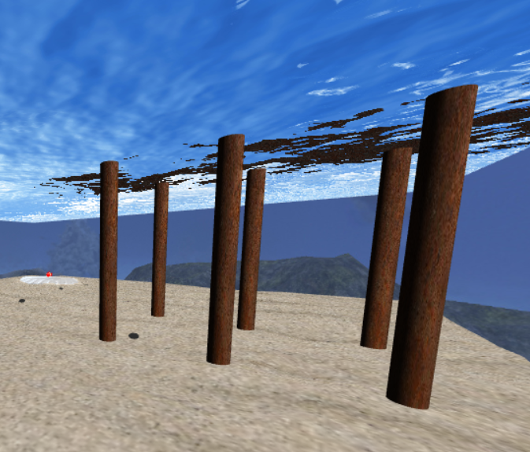
- Side view
### 6 - Scene

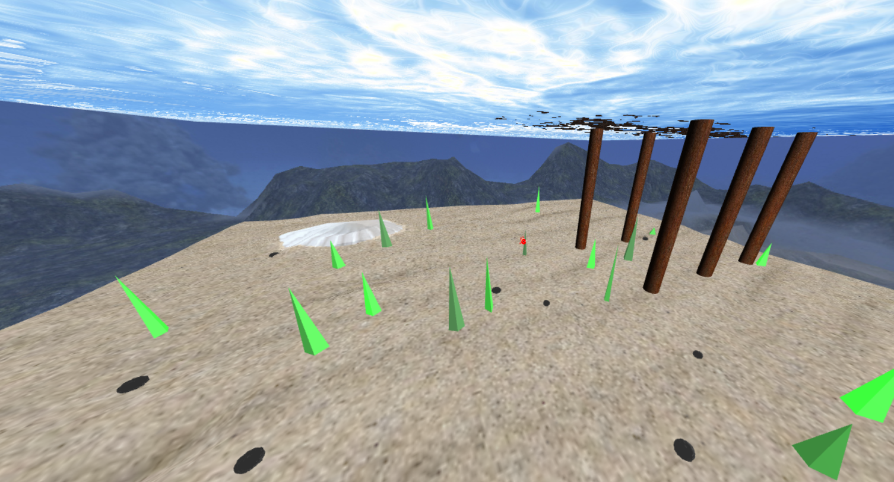
- Full scene

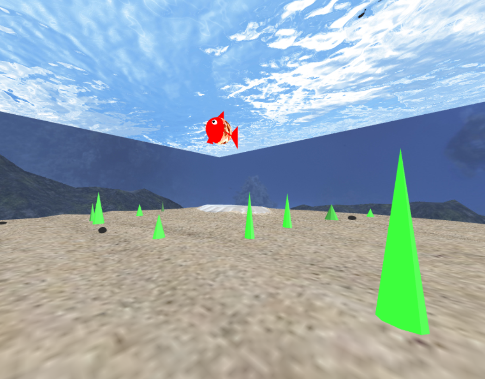
- Another perspective
### 7 - Moving Rocks

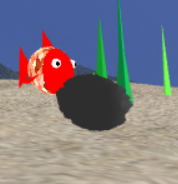
- Fish carrying rock

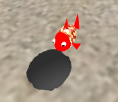
- Another perspective

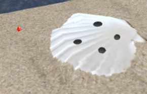
- Rock placement on shell

### 8 - Optional functionalities

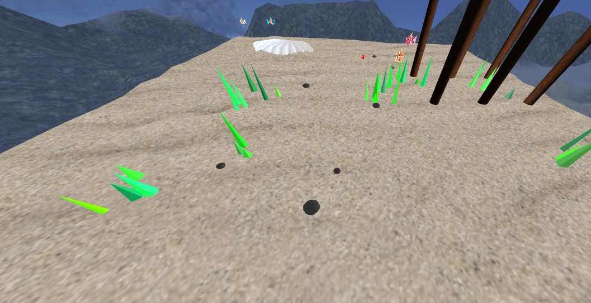
- Random groups of algae

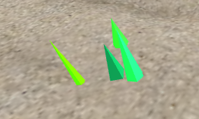
- Algae with different shades

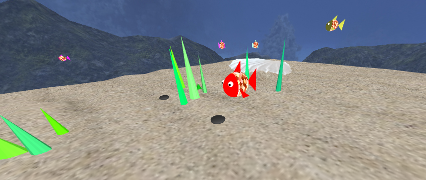
- Automated and randomized fish on scene

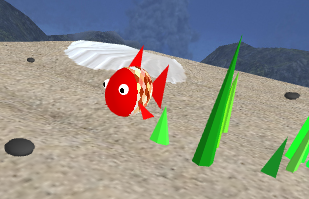
- Fish after improved shader
